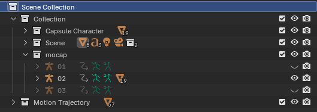

# User Guide

## ▶️ Running the Blender File

Example Blender files are provided under the `blender_file/` directory. Three categories of motions are included:

* `basic`
* `dance`
* `sport`

Each folder contains a Blender file with pre-loaded BVH motion data.

For example:

1. Open Blender
2. Navigate to:

```text
blender_file/basic/basic.blend
```

3. Open the `.blend` file
4. Press **Space Bar** to play the animation

---

## 🖥️ User Interface

### Play Animation

To play or pause the animation:

* Press **Space Bar**

---

### Scene Collection



The Scene Collection contains all assets used for visualization:

* **Capsule Character**

  * Humanoid character model

* **Scene**

  * Ground plane
  * Coordinate axes
  * Other scene elements

* **Mocap**

  * Original BVH motion capture data

**Note:**

The example Blender file contains three mocap files, but only the second motion has been retargeted to the humanoid character. To visualize additional mocap files, further motion retargeting is required.

---

## ⚙️ Customization (Optional)

This section is not required for running the provided examples. It is intended for users who want to visualize their own motion capture data.

Python scripts are located under the `code/` directory:

### 1. `to_csv.py`

Purpose:

* Converts a BVH file into CSV format

Input:

* BVH file

Output:

* CSV file

---

### 2. `per_joint_scalar.py`

Purpose:

* Computes per-joint motion scalar values from the CSV motion data

Input:

* Motion CSV file

Output:

* Motion scalar CSV file

---

### 3. `blender_script.py`

Purpose:

* Runs inside Blender
* Reads computed scalar values
* Projects motion intensity values onto character joints for visualization

---

## 🔄 Processing Pipeline

```text
Original BVH File
        │
        ▼
to_csv.py
        │
        ▼
Motion CSV File
        │
        ▼
per_joint_scalar.py
        │
        ▼
Motion Scalar CSV File
        │
        ▼
blender_script.py
        │
        ▼
Motion Visualization in Blender
```

---

## ⚠️ Important Notes

The provided Python files currently contain local file paths from the development environment.

Before running the scripts:

* Update file paths in each Python file
* Replace them with paths corresponding to your local system

Otherwise the scripts may fail to execute properly.
